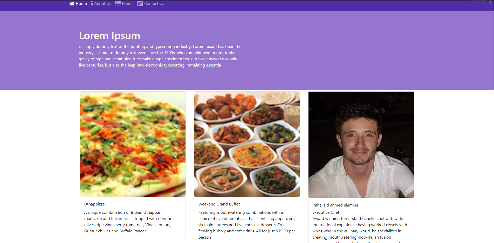

# Reastaurant react web app

## Build with
- React
- Readux
- HTML/css 

## Getting Started
Get a local copy up and follow this steps

## Prerequisites
- node js
- React

## Local Development
- This app fetch data from  JSON SERVER you can find it here  https://github.com/minos95/restaurantReactAppServer
- Open the terminal and start a app with 'yarn start'
- Open http://localhost:5000 in your browser

## Usage
- Sign up as a buyer by providing a name, email, address and password.
- Start browsing todo 
- Add Spaces and then add todo 

## The Author
- GitHub: @minos95
- Twitter: @aminos_rahal
- LinkedIn: rahal sidahmed
